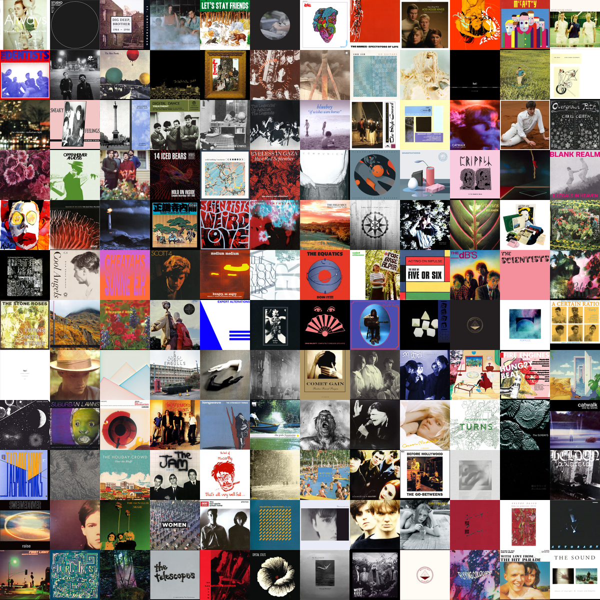

# WhatCD Collage
This simple module uses the [WhatCD AJAX API](https://github.com/WhatCD/Gazelle/wiki/JSON-API-Documentation) to extract all of the images within an album collage, and stitch them together into a single image.

#### Requirements:
Easily install the requirements using `pip`.

```
pip install -r requirements.txt
```

#### Run:
Command line:

```shell
$ python whatcollage.py -u <username> -p <password> -id <ID> [-s SIZE SIZE] [-r] [-t {100,200,300}] [-f FNAME]
```
* `-u, --user`: Your WhatCD username.

* `-p, --passw`: Your WhatCD password.

* `-id`: The collage ID, which can be found in the collage `URL` as such: `https://what.cd/collages.php?id=23184`

* `-s, --size`: Height and width of your collage image. Would recommend an `n x n` size; `2400 x 2400` looks neat...Set to `1200 x 1200` by default.

* `-r`: Use this option if you want the album images to appear out of order from the original collage. Set to `False` by default.

* `-t, --thumbnail`: Size of each individual album art within the collage. Shouldn't be set past `300`, since it won't look very nice. Set to `100` by default.

* `-f, --fname`: The desired output file name. Set to `collage.png` by default.

As an imported module:

```python
>>> from whatcollage import WhatCollage
>>> whatcd = WhatCollage("username", "password") # Log in with your credentials.
>>> what.collage(23184, (1200, 1200), random = True)
>>> whatcd.logout() # Kindly logout when done.
```

The `collage` function that builds the collage:

```python
collage(id, size, random = False, thumbnail = None, fname = None)
```

Here's the result for the previous example:


